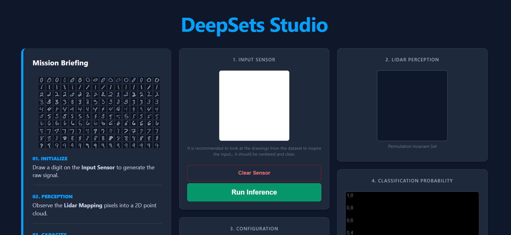

# Deep Sets: MNIST Point Cloud Analysis (DEMO)

This repository contains the source code, experimental results, and implementations for an analysis of **Deep Sets** architectures (Zaheer, M., et al. (2017)) and its limitations to the MNIST dataset.

<p align="center">
  
</p>

The project validates the Information Bottleneck hypothesis proposed by Wagstaff et al. (2019) by training permutation-invariant networks to classify MNIST digits converted into 2D point clouds. It demonstrates how the Latent Dimension constrains the model's ability to preserve topological information.

<p align="center">
  
</p>

## Repository Structure
```text
.
├── data/                    # Dataset storage (MNIST Point Clouds)
├── saved_models/            # Checkpoints for trained models
├── templates/               # HTML templates for the web demo
├── app.py                   # Flask application for the web interface
├── dataset.py               # Custom PyTorch Dataset (Image -> Point Cloud conversion)
├── experiment.py            # Main script: Latent Dimension vs. Accuracy experiment
├── model.py                 # Deep Sets architecture implementation (Phi + Rho)
├── prepare_demo.py          # Script to pre-train models for the demo app
├── train.py                 # Training and validation loops
├── wagstaff_experiment_result.png # Generated results graph
└── MNIST_dataset_example.png # Visualization of the input data
```

## Getting Started

### Prerequisites

The project requires Python 3.8+ and the following libraries:

```bash
pip install torch torchvision numpy matplotlib flask

```

### 1. Reproducing the Scientific Experiment (NOT MANDATORY - Go to Section 3)

To run the full experimental loop which trains multiple models with varying latent dimensions () and generates the comparison graph:

```bash
python experiment.py

```

*This will automatically download MNIST, train the models, and save `wagstaff_experiment_result.png`.*

### 2. Preparing the Web Demo (NOT MANDATORY - Go to Section 3)

To launch the interactive web interface where you can visualize predictions:

First, ensure you have trained models: 
```bash
python prepare_demo.py

```

### 3. Running the Web Demo

Then, start the Flask app:

```bash
python app.py

```

Open your browser at `http://127.0.0.1:5000/`.

## References

1. **Zaheer, M., et al. (2017).** *Deep Sets*. Advances in Neural Information Processing Systems (NIPS). 


2. **Wagstaff, E., et al. (2019).** *On the Limitations of Representing Functions on Sets*. International Conference on Machine Learning (ICML). 


## Author: Alvaro Martínez Felipe, SDD, Engineering Diploma ISAE SUPAERO


